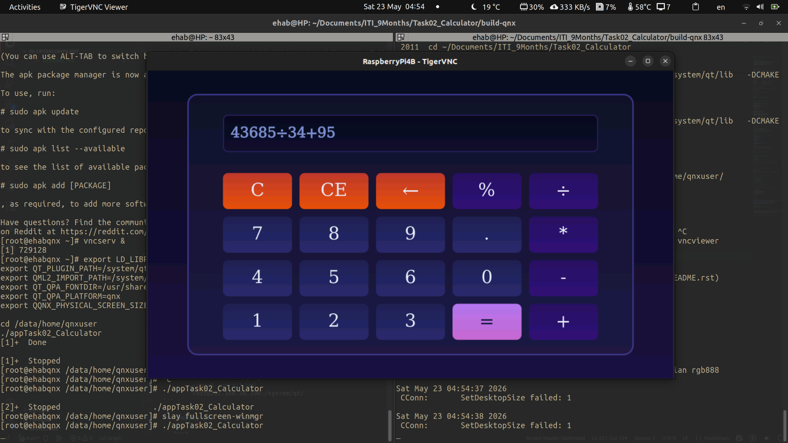

# Cross-Compiling Qt 6.10 for QNX 8.0 (Raspberry Pi 4B / aarch64)

A step-by-step guide to cross-compiling Qt 6.10.2 for QNX SDP 8.0 targeting an ARM64 device (Raspberry Pi 4B), from a Linux x86_64 host machine.


---

## Table of Contents

- [Prerequisites](#prerequisites)
- [Directory Layout](#directory-layout)
- [Step 1 — Source the QNX SDP Environment](#step-1--source-the-qnx-sdp-environment)
- [Step 2 — Create the CMake Toolchain File](#step-2--create-the-cmake-toolchain-file)
- [Step 3 — Configure Qt for QNX](#step-3--configure-qt-for-qnx)
- [Step 4 — Build and Install Qt](#step-4--build-and-install-qt)
- [Step 5 — Build Your Application](#step-5--build-your-application)
- [Step 6 — Deploy to the Target Device](#step-6--deploy-to-the-target-device)
- [Runtime Setup on the Device](#runtime-setup-on-the-device)
- [Troubleshooting](#troubleshooting)
- [Notes](#notes)

---

## Prerequisites

| Requirement | Details |
|---|---|
| **OS** | Linux x86_64 host (Ubuntu recommended) |
| **Qt 6.10.2** | Installed via Qt Online Installer, including **Sources** and **Desktop gcc 64-bit** components |
| **QNX SDP 8.0** | Installed at `~/qnx800/` — requires a valid QNX license |
| **CMake** | Version 3.16+ (`/usr/bin/cmake`) |
| **Ninja** | Build system (`sudo apt install ninja-build`) |

> **Important:** Do NOT install the experimental Wayland packages from the QNX Software Center. They cause header conflicts during Qt configuration.

---

## Directory Layout

After completing this guide, your relevant directories will be:

```
~/qnx800/                        # QNX SDP 8.0 installation
│   ├── host/linux/x86_64/       # QNX host tools (qcc, q++, etc.)
│   ├── target/qnx/              # QNX target sysroot
│   └── qnxsdp-env.sh            # Environment setup script

~/Qt/6.10.2/
│   ├── gcc_64/                  # Host Qt build (tools: moc, rcc, qmlcachegen)
│   └── Src/                     # Qt source code

~/qnx8-install/                  # ← Final Qt install for QNX (deploy this to device)
│   ├── bin/qt-cmake             # Use this to build your apps
│   ├── lib/                     # Qt shared libraries for QNX aarch64
│   ├── plugins/                 # Qt plugins (QPA, imageformats, etc.)
│   └── qml/                     # QML imports

~/Documents/.../qt6-qnx-build/  # Temporary build dir — DELETE after install
```

---

## Step 1 — Source the QNX SDP Environment

Run this **every time** you open a new terminal before doing any QNX-related work:

```bash
source ~/qnx800/qnxsdp-env.sh
```

To make this permanent, add it to your shell profile:

```bash
echo 'source ~/qnx800/qnxsdp-env.sh' >> ~/.bashrc
source ~/.bashrc
```

Verify it worked:

```bash
echo $QNX_HOST    # /home/<user>/qnx800/host/linux/x86_64
echo $QNX_TARGET  # /home/<user>/qnx800/target/qnx
which q++         # /home/<user>/qnx800/host/linux/x86_64/usr/bin/q++
```

---

## Step 2 — Create the CMake Toolchain File

Create a file at `~/qnx8-rpi4.cmake`:

```cmake
set(CMAKE_SYSTEM_NAME QNX)
set(CMAKE_SYSTEM_VERSION 800)           # QNX SDP 8.0
set(CMAKE_SYSTEM_PROCESSOR aarch64le)   # RPi 4B is ARM64

set(CMAKE_C_COMPILER qcc)
set(CMAKE_C_COMPILER_TARGET gcc_ntoaarch64le)
set(CMAKE_CXX_COMPILER q++)
set(CMAKE_CXX_COMPILER_TARGET gcc_ntoaarch64le)

set(CMAKE_FIND_ROOT_PATH
    $ENV{QNX_TARGET}
    $ENV{QNX_TARGET}/aarch64le
)

set(CMAKE_SYSROOT $ENV{QNX_TARGET})

set(CMAKE_FIND_ROOT_PATH_MODE_PROGRAM NEVER)
set(CMAKE_FIND_ROOT_PATH_MODE_LIBRARY ONLY)
set(CMAKE_FIND_ROOT_PATH_MODE_INCLUDE ONLY)

# Workaround: CMake does not pass these correctly on QNX
set(CMAKE_STRIP   $ENV{QNX_HOST}/usr/bin/ntoaarch64-strip)
set(CMAKE_AR      $ENV{QNX_HOST}/usr/bin/ntoaarch64-ar)
set(CMAKE_RANLIB  $ENV{QNX_HOST}/usr/bin/ntoaarch64-ranlib)
set(CMAKE_NM      $ENV{QNX_HOST}/usr/bin/ntoaarch64-nm)
```

> **Note:** Always use the **full absolute path** to this file when passing it to CMake.
> Never use `~` — CMake does not expand shell shortcuts.

---

## Step 3 — Configure Qt for QNX

### Check which host tool packages are available

Before configuring, identify which Qt modules have host tools installed.
Any module **not** listed here will need a `-skip` flag:

```bash
ls ~/Qt/6.10.2/gcc_64/lib/cmake/ | grep Tools
```

### Modules to skip

The following modules must be skipped for QNX SDP 8.0 (either unsupported or missing host tools):

| Module | Reason |
|---|---|
| `qtmultimedia` | Not supported on QNX SDP 8.0 |
| `qtspeech` | Not supported on QNX SDP 8.0 |
| `qtremoteobjects` | Not supported on QNX SDP 8.0 |
| `qtinterfaceframework` | Not supported on QNX SDP 8.0 |
| `qtlottie` | Requires `Qt6LottieTools` — not in default Online Installer |
| `qtgrpc` | Requires `protoc` and `Qt6GrpcTools` |
| `qtscxml` | Requires `Qt6ScxmlTools` — not in default Online Installer |
| `qtwebengine` | Not supported on QNX |

### Run configure

```bash
mkdir ~/qt6-qnx-build && cd ~/qt6-qnx-build

~/Qt/6.10.2/Src/configure \
  -nomake examples \
  -nomake tests \
  -qt-host-path ~/Qt/6.10.2/gcc_64 \
  -extprefix ~/qnx8-install \
  -prefix /qt \
  -skip qtmultimedia \
  -skip qtspeech \
  -skip qtremoteobjects \
  -skip qtinterfaceframework \
  -skip qtlottie \
  -skip qtgrpc \
  -skip qtscxml \
  -skip qtwebengine \
  -- \
  -DCMAKE_TOOLCHAIN_FILE=/home/$USER/qnx8-rpi4.cmake \
  -DCMAKE_SYSTEM_VERSION=800 \
  ~/Qt/6.10.2/Src
```

| Flag | Purpose |
|---|---|
| `-qt-host-path` | Host Qt build providing `moc`, `rcc`, `qmlcachegen`, etc. |
| `-extprefix` | Local install destination on your build machine |
| `-prefix /qt` | Deployment path **on the target device** |
| `-nomake examples/tests` | Skip building examples and tests to save time |

---

## Step 4 — Build and Install Qt

```bash
# Build (limit parallelism — QNX compiler is memory-heavy)
cmake --build . --parallel 4

# Install to ~/qnx8-install
cmake --install .
```

> **Memory tip:** Use 1 parallel job per 2–3 GB of free RAM.
> Check available RAM with `free -h` and core count with `nproc`.

Expected build time:

| Parallel jobs | Estimated time |
|---|---|
| 2 | 3–5 hours |
| 4 | 1.5–3 hours |
| 8 | 45–90 minutes |

### Clean up the build directory

Once installed, the build directory is no longer needed and can be deleted to free disk space:

```bash
rm -rf ~/qt6-qnx-build
```

Everything useful is now in `~/qnx8-install/`.

---

## Step 5 — Build Your Application

> You only built Qt once. For every app you write, just do this:

```bash
cd /path/to/your/app
mkdir build-qnx && cd build-qnx

# qt-cmake handles toolchain, sysroot, and compiler automatically
mkdir build-qnx && cd build-qnx
~/qnx8-install/bin/qt-cmake   -DCMAKE_INSTALL_RPATH=/system/qt/lib   -DCMAKE_BUILD_RPATH=/system/qt/lib

cmake --build .
```

The resulting binary is cross-compiled for QNX aarch64 and ready to deploy.

---

## Step 6 — Deploy to the Target Device

### Deploy Qt runtime (first time only)

```bash
scp -r ~/qnx8-install/lib \
        ~/qnx8-install/plugins \
        ~/qnx8-install/qml \
        root@192.168.50.100:/system/qt/
```

### Deploy your app binary

```bash
scp appTask02_Calculator root@192.168.50.100:/data/home/qnxuser/
```

---

## Runtime Setup on the Device

Before launching any Qt application on the QNX device, ensure the following services are running and environment variables are set:

```bash
slay fullscreen-winmgr

# Environment variables
export LD_LIBRARY_PATH=/system/qt/lib
export QT_PLUGIN_PATH=/system/qt/plugins
export QML2_IMPORT_PATH=/system/qt/qml
export QT_QPA_FONTDIR=/usr/share/fonts/dejavu
export QT_QPA_PLATFORM=qnx
export QQNX_PHYSICAL_SCREEN_SIZE=1280,600

# if using vncviewer
vncserv &

cd /data/home/qnxuser
# Run your app
./appTask02_Calculator

# then, in your host 
vncviewer
```

---

## Notes

- **This process is done once per Qt version.** After `~/qnx8-install/` is built, all future app cross-compilations take only seconds to minutes.
- The `qt-cmake` wrapper in `~/qnx8-install/bin/` automatically loads the correct toolchain file, so you never need to specify it again per-app.
- If deploying to a device where Qt was not built locally, pass the toolchain explicitly:
  ```bash
  ~/qnx8-install/bin/qt-cmake -DQT_CHAINLOAD_TOOLCHAIN_FILE=/path/to/qnx8-rpi4.cmake .
  ```
- For QNX SDP 7.1, use `-DCMAKE_SYSTEM_VERSION=710` instead of `800`.

---

*Generated for Qt 6.10.2 · QNX SDP 8.0 · Target: Raspberry Pi 4B (aarch64)*